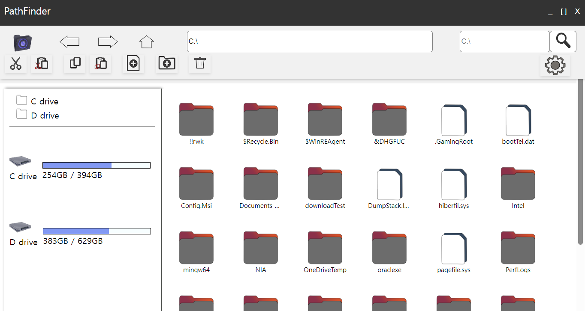

<p align="center">

</p>
<br>
<br>
<p align="center">
<b>
  Simple File explorer Project by using Tauri and SvelteKit
</b>
</p>
<br>
<br>

# Overview

we developed a file explorer project with key strengths such as fast search speed, customizable themes, and multi-language support. This tool allows users to efficiently manage and locate files while offering a personalized user experience through theme and language settings.

## Main Features

- Fast Search
- Various themes
- Selectable Languanges

## Tech Stack

- Tauri / Rust / Tokio
- SvelteKit / TypeScript

## System Architecture
<p>

</p>

## Backend API Documents
- It will be located at src-tauri / target / doc / app
- It seems docs sometimes makes initial dev build slower
- so i recommand not to make all docs which contains deps

## Custom icons
- directory icons
<p>

</p>

- file icons
<p>

</p>

## ScreenShots
<p>Intro screen</p>
<p>

</p>

<p>Main screen</p>
<p>

</p>

<p>Modal</p>
<p>

</p>

<p>XP-style theme</p>
<p>

</p>

<p>SF-style theme</p>
<p>

</p>

<p>Linux-style theme</p>
<p>

</p>


## Projects Settings
- Prerequisite : npm, Tauri CLI

- Download

```bash
git clone https://github.com/kdhProg/customFileExplorer
```
or
```bash
gh repo clone kdhProg/customFileExplorer
```

## Todos

- Optimize Searching API
- More UI Themes
- User-Customizable UI
- Unzip functions

## Commands

Frontend dev server

```bash
npm run dev
```

Frontend build
```bash
npm run build
```

Development Build 
```bash
cargo tauri dev
```
or
```bash
npm run tauri dev
```

Rust Docs Build ( Not root directory, should move to "src-tauri")
(includes all dependencies - it will make all of docs which contains deps)
```bash
cargo doc --open
```
(without dependencies, only user-written API)
```bash
cargo doc --no-deps --open
```


### Tauri Sveltekit reference

>[ref](https://tauri.app/ko/v1/guides/getting-started/setup/sveltekit/)

### Install Tauri cli
```bash
npm install --save-dev @tauri-apps/cli
```
