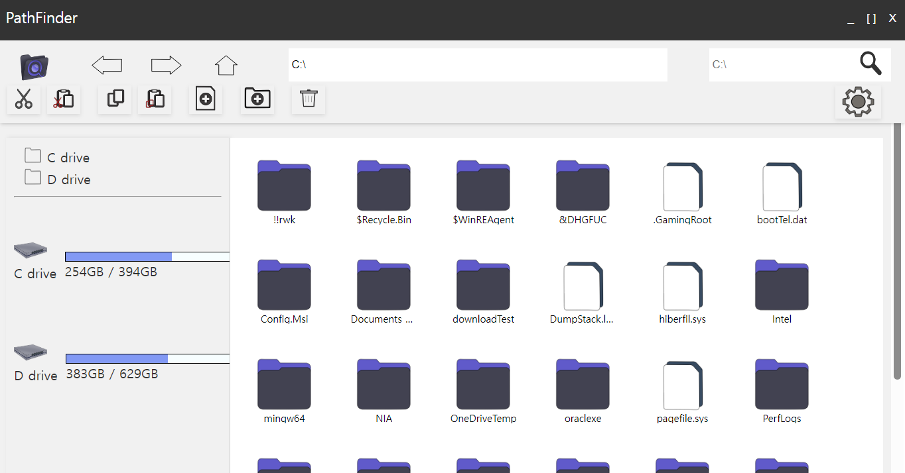
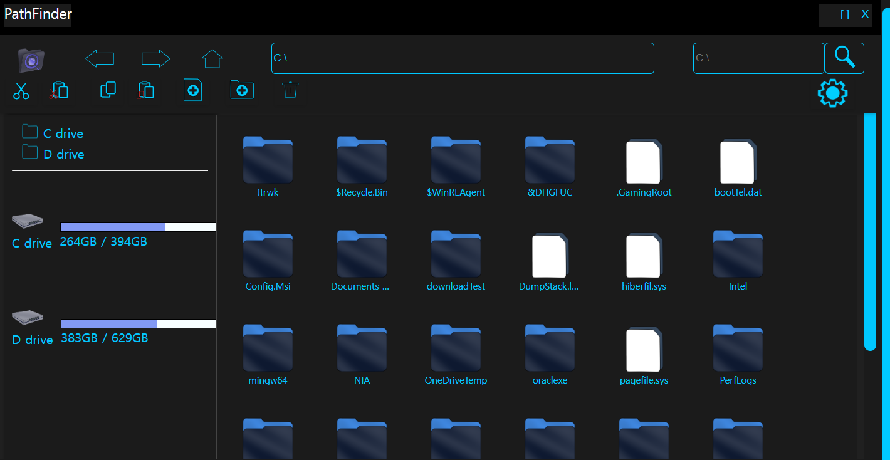

<p align="center">

</p>
<br>
<br>
<p align="center">
<b>
  Simple File explorer Project by using Tauri and SvelteKit
</b>
</p>
<br>
<br>

# Overview

we developed a file explorer project with key strengths such as fast search speed, customizable themes, and multi-language support. This tool allows users to efficiently manage and locate files while offering a personalized user experience through theme and language settings.

## Main Features

- Search with Various options
- Selectable Util buttons & UI sets

## Tech stack

- **Tauri / Rust**
  - rust & cargo 1.79.0
- **SvelteKit**
  - npm 10.5.0


## System Architecture
<p>

</p>

## Feature Details

### Utils
- All utility buttons can be placed on the screen according to user settings.
- Cut / Copy / Paste
  - Separate operations exist for Copy with Paste and Cut with Paste. As a result, the copy and cut clipboards are independent, allowing both tasks to proceed simultaneously without conflicts. Additionally, clipboard contents can be visually inspected.

  - Copy principle: A copy receives the suffix _copy. If a name conflict occurs, numbering is applied.

- Delete

- Create New Folder / Create New File
  - For new files, they are generated in the format new.txt to prevent name conflicts. If a conflict occurs, numbering is applied.
- shortcut
  - copy : ctrl + c
  - copy-paste : ctrl + v
  - cut : ctrl + x
  - cut-paste : ctrl + shift + x
  - delete(move to recycle bin) : del
  - select all : ctrl + a
  - (search box) toggle language(EN / KR) : ctrl + space
- Todos : customize shortcut / configurable newly created file or folder's name(if file, type too)

### UI configurable settings
  - File viewer each icon's area size
  - entire themes
    - Default / Linux-theme / Retro-theme / Dark-theme
  - Languague
    - now available : EN, KR
  - Util buttons deployment


### Custom Categories
  - You can make your custom categories and add / remove file or folder
  - configurable options : name / description / color
  - **Caution**
    - file "Rename" not sufficiently work -> plan to fix
    - another potential unintentional bugs may exists


### Search keyword autocomplete
- It gets the top 30 most searched keywords based on log files from the logs folder and suggest them as autocomplete recommendations.
- **Note:** Valid log files must exist.
- **To-Do List:**
  - Currently, the number of top keywords is hardcoded in the backend. Allow users to select how many top keywords to retrieve and apply criteria beyond just search frequency.
  - Implement functionality to complete the currently suggested keyword when pressing the Tab key or similar, even if the entire keyword has not yet been typed.

### Search Language toggle
- Currently 2 languages supported : EN / KR
- shortcut : ctrl + space
- Algorithm thanks to : [https://theyt.net/wiki/%ED%95%9C%EC%98%81%ED%83%80%EB%B3%80%ED%99%98%EA%B8%B0]

### Search API basic features
- Asynchronous processing
- Multi-threaded parallel processing
- Cache based on search history
- Real-time search result display
- Search cancellation supported


### Advanced API Search features
- Thread pool configuration
  - Default / 4 / 8 / 16 / 32
- Search targets can be specified
  - Folders & files
  - Files only
  - Folders only
- Search within file contents:
  - Be aware that this may cause performance degradation.
  - Applied only to text files which decided by MIME text type.
    - Note: MIME Types Returned Are Not Stable/Guaranteed
  - Special similarity-based search methods do not search within file contents.
- File attribute filtering:
  - File size: Up to 100GB
    - Folder size filtering is not yet supported: Recursive traversal of folders may cause significant performance degradation.
  - Creation date
  - Modification date
  - File type: Input as a list of extensions. Example: .txt .pdf
  - File owner:
    - Retrieving file owner via shell commands may cause performance issues.
    - Requires administrator privileges.
- Search symbolic links:
  - Be cautious, as symbolic links can create circular references.
  - No logic to handle circular references has been implemented yet.

- Search methods:
  - If access permission issues occur, the search will skip the path and continue.
  - Basic search: Checks if the search string is contained within the target (contains operation).
  - Regular expressions: Must be written according to Rust regex syntax.
  - Fuzzy Matching 1: Damerau-Levenshtein distance
  - Fuzzy Matching 2: Jaccard Similarity
      - The threshold used for fuzzy matching is specified in a separate JSON file.
Option to generate search logs.

- logs: 
  - Users can choose logs to be saved
  - location : **project root / logs**
  - log contents : 
    - keyword
    - search option values
    - search directory
    - start time & end time & duration
    - results(list)
    - result length
---

## Custom icons
- directory icons
<p>

</p>

- file icons
<p>

</p>

## ScreenShots
<p>Intro screen</p>
<p>

</p>

<p>Main screen</p>
<p>

</p>

<p>Modal</p>
<p>

</p>

<p>XP-style theme</p>
<p>

</p>

<p>SF-style theme</p>
<p>

</p>

<p>Copy & Cut Clipboards visualize</p>
<p>

</p>

<p>Clipboard toggle : extend</p>
<p>

</p>

<p>Clipboard toggle : shrink</p>
<p>

</p>


## Projects Settings
- Download

```bash
git clone https://github.com/kdhProg/customFileExplorer
```
or
```bash
gh repo clone kdhProg/customFileExplorer
```

## Backend API Documents
- It will be located at src-tauri / target / doc / app
- It seems docs sometimes makes initial dev build slower
- so i recommand not to make all docs which contains deps

## Todos

- Optimize Searching API
- More UI Themes
- More Configurable UI
- Unzip functions
- Configurable Shortcut key
- Configurable fuzzy-matching thresholds (It currently located at outer json)
- Enhance Cache System ( json > DB : ex/ redis, sqlite )
- Add AI Model to recommand Search Keyword
- Re-design file-viewer right-click modal

## Cautions
- Not Sufficiently tested at Linux or Unix OS
- In the case of Advanced Search options : file property-owner, Although It requires [ admin or root ] previlege, when dev mode, It skipped
- Not yet detecting changes in file system in real time

## Commands

**Frontend dev server**

```bash
npm run dev
```

**Frontend build**
```bash
npm run build
```

**Development Build** ( It may automatically run either front and backend server)
```bash
cargo tauri dev
```
or
```bash
npm run tauri dev
```

**Rust Docs Build** ( Not root directory, should move to "src-tauri")
(includes all dependencies - it will make all of docs which contains deps)
```bash
cargo doc --open
```
(**without dependencies**, only user-written API)
```bash
cargo doc --no-deps --open
```


### Tauri Sveltekit reference

>[ref](https://tauri.app/ko/v1/guides/getting-started/setup/sveltekit/)

